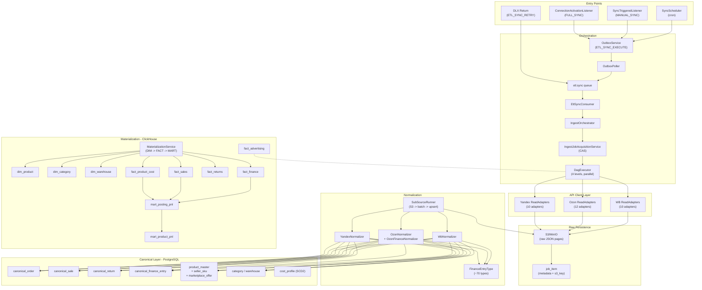

# ETL Pipeline Deep Audit — DataPulse

> **Дата:** 2026-04-12
> **Scope:** Ozon, Wildberries, Yandex Market — полный pipeline raw → canonical → facts/dims/marts
> **Вердикт:** Sufficient with must-fix issues (5 Critical, 9 High, 14 Medium, 10 Low)

---

## 1. Executive Summary

ETL-контур архитектурно зрелый — DAG-оркестрация, CAS-based FSM, outbox pattern, streaming capture (64KB), S3 raw storage, Jackson streaming normalization, ClickHouse star schema с ReplacingMergeTree. Основная конструкция **production-ready** для Ozon и WB.

**Самые опасные места:**
- Тихая потеря финансовых данных (SubSourceRunner + WbFinanceReadAdapter)
- Yandex Market: финансы не подключены к canonical — полный gap
- Workspace isolation не завершена в ClickHouse (fact_product_cost, dim_warehouse)
- Mart joins без workspace_id — риск кросс-тенантного смешения

**Самые большие риски по корректности данных:**
- `mart_posting_pnl` / `mart_product_pnl` могут давать искажённый P&L из-за join-проблем и неполных COGS
- Новые типы финансовых операций Ozon/WB тихо уходят в OTHER без alert-а
- WB finance capture может обрезать выгрузку без fail-а job

**Ключевое архитектурное решение (подтверждено):**
- 1 workspace = 1 account per marketplace
- Бизнес-ключ в аналитике: `(workspace_id, source_platform)`
- `connection_id` — provenance FK, не участвует в агрегации и join-ах мартов

---

## 2. Scope Map

---

## 3. Findings

### CRITICAL (5)

| ID | Название | Слой | Marketplace | Суть | Fix |
|----|----------|------|-------------|------|-----|
| F-01 | SubSourceRunner batch error | Normalization | Все | Ошибка батча проглатывается, страница PROCESSED, данные потеряны | Phase 1 |
| F-02 | WbFinanceReadAdapter silent stop | API Client | WB | catch-all при capture → тихий обрыв пагинации финансов | Phase 1 |
| F-03 | Yandex finance not wired | Normalization | Yandex | Финансы скачиваются в S3, но не нормализуются и не попадают в canonical | Phase 3 |
| F-04 | fact_product_cost/dim_warehouse no workspace_id | CH Schema | Все | Кросс-тенантное смешение данных себестоимости и складов | Phase 1 |
| F-05 | canonical_order grain | Canonical | Ozon | UNIQUE по postingNumber → multi-line postings теряют строки | Phase 1 |

### HIGH (5)

| ID | Название | Слой | Marketplace | Суть | Fix |
|----|----------|------|-------------|------|-----|
| F-06 | FinanceEntryType → OTHER no alert | Normalization | Ozon, WB | Новые operation types тихо уходят в OTHER | Phase 2 |
| F-07 | Mart SQL connection_id as business key | Materialization | Все | GROUP BY и join-ы используют connection_id вместо (workspace_id, source_platform) | Phase 1 |
| F-09 | Ozon FBO no date-window split | API Client | Ozon | FBO adapter не разбивает большие диапазоны на окна | Phase 2 |
| F-12 | FactProductCostMaterializer time-based | Materialization | Все | Инкремент по `NOW() - 1 hour` вместо watermark | Phase 2 |
| F-13 | Zero test coverage | Tests | Все | 0 E2E тестов, 0 WireMock, 0 CH testcontainers, 0 golden datasets | Phase 3 |

### MEDIUM (5) — require fixes

| ID | Название | Суть | Fix |
|----|----------|------|-----|
| F-14 | WbFinanceReadAdapter wrong RateLimitGroup | WB_STATISTICS вместо WB_FINANCE | Phase 1 |
| F-15 | Index typo in 0004 | idx_cost_profile_user_id ON canonical_finance_entry | Phase 1 |
| F-17 | BidActionRetryConsumer on wait queue | Consumer на wait queue обходит DLX delay | Phase 2 |
| F-19 | ClickHouseMaterializer stub | Мёртвый код | Phase 2 |
| F-23 | cost_profile SCD2 no overlap constraint | Нет защиты от перекрывающихся периодов → неоднозначный COGS | Phase 2 |

### MEDIUM → reassessed after deep analysis (8) — no code fix needed

| ID | Исходный Severity | Пересмотр | Причина |
|----|-------------------|-----------|---------|
| F-11 | HIGH | **FALSE POSITIVE** | `AUTO` ACK = после return listener-а, не до. CAS + reclaim покрывают retry. Осознанный дизайн. |
| F-10 | HIGH | **KNOWN LIMITATION** | Yandex/WB Return DTO не содержат полей суммы — ограничение API, не баг кода |
| F-20 | MEDIUM | **CORRECT** | WB srid = 1 unit, DTO не содержит quantity — hardcode 1 верен |
| F-21 | MEDIUM | **BY DESIGN** | `canonicalName()` — намеренная канонизация для кросс-маркетплейсного маппинга |
| F-22 | MEDIUM | **BY DESIGN** | reconciliation_residual — контрольный остаток, не обязан быть 0 |
| F-16 | MEDIUM | **ACCEPTED RISK** | Outbox send до commit в транзакции, mitigated by CAS downstream |
| F-24 | MEDIUM | **LOW RISK** | Transactional event creation mitigates dedup need |
| F-26 | MEDIUM | **CORRECT** | UNIQUE без connection_id — правильно для модели 1-workspace-1-account |

### NEEDS VERIFICATION (2)

| ID | Суть | Действие |
|----|------|----------|
| F-25 | Ozon page_count — 1-based? max page? | Верифицировать по Ozon API docs |
| F-27 | WB Orders/Sales — flag=0, нет пагинации | Верифицировать контракт WB API: есть ли лимит записей? |
| F-18 | WB UTC, Ozon Moscow, Yandex UTC | Задокументировать per-provider TZ conventions |

### LOW (F-28 — F-37)

S3+PG non-atomic, TailFieldExtractor 32KB, linear backoff outbox, dim_advertising full rebuild, DIMENSION order, missing @Transactional on IngestOrchestrator, EventRunner skip handling, existsActiveForConnection race, OzonPerformanceTokenService cache, Yandex async report timeout.

---

## 4. Gap Matrix

| Area | Ozon | WB | Yandex | Must fix? |
|------|------|-----|--------|-----------|
| API coverage | Good | Good | Good | No |
| Raw completeness | OK | Risk (F-02) | OK | WB: Yes |
| Canonical mapping | Risk (F-05) | Good | Finance missing (F-03) | Ozon+Yandex: Yes |
| Idempotency | CAS ok | CAS ok | CAS ok | No |
| Retry correctness | OK | OK | OK | No |
| Financial accuracy | Risk (F-06, F-07) | Risk (F-01, F-02, F-06, F-07) | N/A | Yes |
| COGS linkage | Risk (F-04, F-12, F-23) | Risk (F-04, F-12, F-23) | N/A | Yes |
| mart_posting_pnl | Risk (F-07) | Risk (F-07) | N/A | Yes |
| Workspace isolation | BROKEN (F-04, F-07) | BROKEN (F-04, F-07) | BROKEN | Yes |
| Tests | Minimal | Minimal | Minimal | Yes (F-13) |

---

## 5. Data Correctness Review

**Что может искажать количество заказов:** F-05 (Ozon multi-line postings → потеря строк canonical_order).

**Что может искажать выручку:** F-01 (потеря батчей), F-02 (обрыв WB finance), F-06 (новые sale-подобные types → OTHER).

**Что может искажать комиссии:** F-06 (commission types → OTHER), F-07 (mart joins → неверная группировка).

**Что может искажать себестоимость:** F-04 (кросс-тенантные COGS), F-12 (пропуск cost changes), F-23 (overlapping SCD2 → неоднозначная цена).

**Что может искажать PnL:** Все вышеперечисленные + F-07.

---

## 6. Phased Fix Plan

### Phase 1 — Data correctness (1-2 недели)

| # | Finding | Severity | Описание | Риск деплоя |
|---|---------|----------|----------|-------------|
| 1 | F-14 + F-15 | MEDIUM | Rate limit group fix + index fix | Минимальный |
| 2 | F-19 | MEDIUM | Dead code cleanup | Минимальный |
| 3 | F-05 | CRITICAL | Ozon multi-line order grain fix | Низкий + resync |
| 4 | F-01 | CRITICAL | SubSourceRunner: batch skip → partial result | Низкий |
| 5 | F-02 | CRITICAL | WbFinanceReadAdapter: typed error handling | Средний |
| 6 | F-04 | CRITICAL | workspace_id в cost/warehouse CH + PG | Средний + rematerialization |
| 7 | F-07 | HIGH | Mart SQL: (workspace_id, source_platform) | Низкий + rematerialization |

### Phase 2 — Stability and observability (2-4 недели)

| # | Finding | Severity | Описание |
|---|---------|----------|----------|
| 8 | F-09 | HIGH | Ozon FBO date-window split |
| 9 | F-06 | HIGH | Unmapped finance types alert |
| 10 | F-12 | HIGH | Cost materializer watermark |
| 11 | F-23 | MEDIUM | cost_profile SCD2 overlap protection |
| 12 | F-17 | MEDIUM | Bid queue split |
| 13 | F-27 | MEDIUM | WB Orders/Sales pagination verification |

### Phase 3 — Coverage and Yandex (4-8 недель)

| # | Finding | Severity | Описание |
|---|---------|----------|----------|
| 14 | F-13 | HIGH | Test coverage: golden datasets, WireMock, CH testcontainers |
| 15 | F-03 | CRITICAL | Yandex finance normalization |

---

## 7. Reassessed Findings — No Fix Needed

| Finding | Исходный Severity | Пересмотр | Причина |
|---------|-------------------|-----------|---------|
| F-11 | HIGH | FALSE POSITIVE | `AcknowledgeMode.AUTO` = ACK после return listener-а. CAS + reclaim — основной механизм. |
| F-10 | HIGH | KNOWN LIMITATION | Yandex/WB Return DTO не содержат amount. Ограничение API. |
| F-20 | MEDIUM | CORRECT | WB srid = 1 unit. Hardcode 1 верен по контракту API. |
| F-21 | MEDIUM | BY DESIGN | `canonicalName()` — намеренный кросс-маркетплейсный маппинг. |
| F-22 | MEDIUM | BY DESIGN | reconciliation_residual — контрольный остаток, не обязан быть 0. |
| F-16 | MEDIUM | ACCEPTED RISK | Outbox send до commit, mitigated by CAS downstream. |
| F-24 | MEDIUM | LOW RISK | Transactional event creation достаточно для dedup. |
| F-26 | MEDIUM | CORRECT | Aligned with 1-workspace-1-account architecture. |
| F-25 | MEDIUM | NEEDS VERIFICATION | Верифицировать Ozon page_count semantics по API docs. |
| F-18 | MEDIUM | DOCUMENTATION | Per-provider TZ conventions верны, задокументировать. |

---

## 8. What Should NOT Be Done Now

- Не менять модульные границы — текущее размещение адаптеров в datapulse-etl работает
- Не переделывать outbox на CDC/Debezium
- Не добавлять Apache Kafka — RabbitMQ с DLX адекватен
- Не переписывать DAG на workflow engine (Temporal/Airflow)
- Не делать real-time streaming ETL
- Не добавлять Schema Registry, Event Sourcing, Multi-datacenter CH, ML anomaly detection
- Не менять ACK mode на MANUAL без перестройки consumer pattern (F-11 = false positive)
